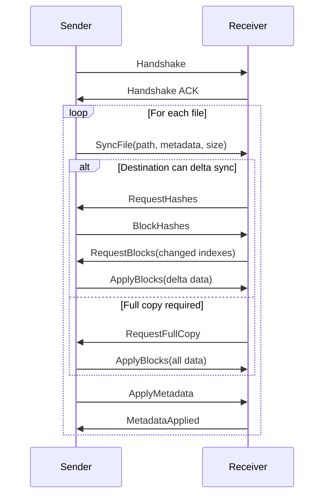
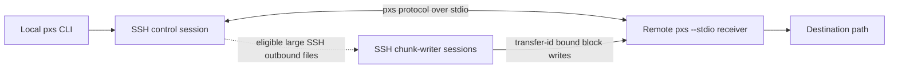
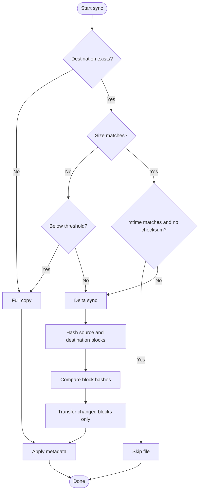

# pxs

[](https://github.com/nbari/pxs/actions/workflows/test.yml)
[](https://github.com/nbari/pxs/actions/workflows/build.yml)
[](https://codecov.io/gh/nbari/pxs)

**pxs** (Parallel X-Sync) is a file synchronization tool written in Rust for
the same broad job as `rsync`: move data trees efficiently and refresh existing
copies with as little work as possible.

The name is intentionally short for CLI use: `pxs` stands for **Parallel X-Sync**.

`pxs` focuses on modern large-data sync workloads, such as repeated refreshes
of large PostgreSQL `PGDATA` directories, VM images, and other datasets with
many unchanged files or large files that are updated in place.

`rsync` remains the reference point in this space. `pxs` is not a drop-in
replacement for it. The goal is narrower: use Rust performance, parallelism,
concurrency, fixed-block delta sync, and high-throughput transport to speed up
data synchronization for workloads where those choices help.

## Key Features

*   **Multi-threaded Engine**: Parallelizes file walking, block-level hashing, and I/O operations.
*   **Fixed-Block Synchronization**: Uses **128KB** chunks and **XxHash64** for ultra-fast delta analysis.
*   **High-Throughput TCP Transport**: Uses a compact binary protocol with **rkyv** serialization over raw TCP.
*   **Unified `sync` CLI**: Uses one public `pxs sync DEST SRC` command shape for local, SSH, and raw TCP flows.
*   **Auto-SSH Mode**: Tunnels through SSH when one side is an `user@host:/path` endpoint.
*   **Staged Atomic Writes**: Preserves an existing destination until the replacement file is fully written and ready to commit.
*   **Smart Skipping**: Automatically skips unchanged files based on size and modification time.

## Installation

Install from crates.io:

```bash
cargo install pxs
```

Build from source:

```bash
cargo build --release
```
The binary will be available at `./target/release/pxs`.

> [!IMPORTANT]
> For **Network** or **SSH** synchronization, `pxs` must be installed and available in the `$PATH` on **both** the source and destination servers.

> [!NOTE]
> **Clock Synchronization**: When using mtime-based skip detection (the default without `--checksum`), ensure source and destination systems have synchronized clocks (e.g., via NTP). Clock skew can cause files to be incorrectly skipped or unnecessarily re-synced. Use `--checksum` to force content-based comparison if clock sync is not guaranteed.

## Platform Support

`pxs` currently targets **Unix-like systems only**:

*   Linux
*   macOS
*   BSD

Windows is **not supported**.

For network and `--stdio` transports, `pxs` uses normalized relative POSIX paths in the protocol. Incoming paths are rejected if they are absolute or contain `.` / `..` traversal components. Paths containing `\` are also rejected by the protocol, so filenames with backslashes are not supported for remote sync.

`pxs` also rejects destination roots and destination parent components that are symlinks. This is intentional: the tool may replace or delete leaf symlink entries inside the destination tree, but it will not write through a symlinked destination root or a symlinked ancestor path component.

## How It Works

### Local Synchronization


### Network Synchronization (Direct TCP)



### SSH Synchronization (Auto-Tunnel)



For normal SSH transfers, `pxs` uses a single control session. For eligible large-file SSH transfers where the source is local and the destination is remote, that control session can spawn additional chunk-writer SSH workers while final metadata, checksum, delete finalization, and completion acknowledgment stay on the control path.

### Delta Sync Algorithm



## Usage

The public sync model is:

```bash
pxs sync DEST SRC
```

The first operand is always the destination. The second operand is always the source.

`DEST` and `SRC` can be:
- local filesystem paths
- SSH endpoints like `user@host:/path`
- raw TCP endpoints like `host:port/path`

Examples for each transport:

```bash
# Local: file -> file
pxs sync backup.bin file.bin

# Local: directory -> directory
pxs sync /path/to/dest_dir /path/to/source_dir

# SSH: remote file -> local file
pxs sync ./local_file.bin user@remote-server:/path/to/remote/file.bin

# SSH: local file -> remote file
pxs sync user@remote-server:/path/to/dest/file.bin ./file.bin

# SSH: remote directory -> local directory
pxs sync /srv/restore/data user@remote-server:/srv/export/data

# SSH: local directory -> remote directory
pxs sync user@remote-server:/srv/incoming/data /var/lib/postgresql/data

# Raw TCP: remote file -> local file
pxs sync ./snapshot.bin 192.168.1.10:8080/snapshot.bin

# Raw TCP: local file -> remote file
pxs sync 192.168.1.10:8080/incoming/snapshot.bin ./snapshot.bin

# Raw TCP: remote directory -> local directory
pxs sync /srv/restore/data 192.168.1.10:8080/pgdata

# Raw TCP: local directory -> remote directory
pxs sync 192.168.1.10:8080/incoming/pgdata /var/lib/postgresql/data

# Force checksum-based verification
pxs sync /mnt/backup/dataset.bin ./dataset.bin --checksum

# Flush committed data before completion
pxs sync /mnt/backup/dataset.bin ./dataset.bin --fsync
```

> [!IMPORTANT]
> The built-in SSH transport is designed for non-interactive authentication. In practice, that means SSH keys, `ssh-agent`, or an already-established multiplexed SSH session. Interactive password prompts are not a supported workflow for `pxs sync` with SSH endpoints.

### Raw TCP Setup
Raw TCP still needs a service process on the remote side. `sync` is the client-facing transfer command; `listen` and `serve` are the server-side setup commands.

#### `listen`
Use this on the receiving host to expose an allowed destination root for incoming raw TCP sync sessions.

```bash
# Expose /srv as the allowed destination root
pxs listen 0.0.0.0:8080 /srv

# Same, but durably fsync committed changes
pxs listen 0.0.0.0:8080 /srv --fsync
```

Then the sending side targets a path inside that root:

```bash
pxs sync 192.168.1.10:8080/incoming/snapshot.bin ./snapshot.bin
pxs sync 192.168.1.10:8080/incoming/pgdata /var/lib/postgresql/data
```

> [!IMPORTANT]
> `listen` rejects symlinked roots, and requested raw TCP destination paths are resolved beneath the configured root with the same symlink-safety checks used by local and SSH sync.

#### `serve`
Use this on the source host to expose an allowed source root for incoming raw TCP sync sessions.

```bash
# Expose /srv/export as the allowed source root
pxs serve 0.0.0.0:8080 /srv/export

# Keep checksum policy on the source host
pxs serve 0.0.0.0:8080 /srv/export --checksum
```

Then the client selects a path inside that root:

```bash
pxs sync ./snapshot.bin 192.168.1.10:8080/snapshots/base.tar.zst
pxs sync /srv/restore/data 192.168.1.10:8080/pgdata --checksum
```

For raw TCP endpoints, the path in `host:port/path` selects what to read or write within the configured `serve` or `listen` root. Per-sync flags such as `--checksum`, `--threshold`, `--delete`, and `--ignore` are carried by the client `pxs sync` request.

### Legacy Aliases
`push` and `pull` still exist as hidden compatibility aliases, but the public CLI and README now standardize on `pxs sync DEST SRC`.

## PGDATA Migration Script

This repository includes [`sync.sh`](./sync.sh), a PostgreSQL-focused migration helper built around repeated `pxs sync DEST SRC` passes over SSH.

- Run it from the source host where `PGDATA` lives.
- It opens a local `psql` session, calls `pg_backup_start(...)`, performs repeated SSH sync passes, calls `pg_backup_stop()`, and installs the resulting `backup_label` on the destination.
- Local `PGDATA` files are not modified by the script, but the local PostgreSQL instance does temporarily enter and exit backup mode.
- Filesystem mutations happen on the remote destination: directory creation, file replacement, mirror cleanup via `--delete`, and `backup_label` installation.
- The bundled script is currently speed-first: it runs all `pxs sync` passes with `--delete` and without `--fsync` so you can benchmark raw transfer speed first.
- The script assumes the remote SSH session already runs as the intended PostgreSQL OS user or otherwise writes with the correct ownership for the destination cluster.

> [!IMPORTANT]
> PostgreSQL tablespaces appear as symlinks under `pg_tblspc`. `pxs` preserves those symlinks as symlinks; it does not provision or rewrite the referenced tablespace targets for you. The destination host must already provide valid tablespace target paths.

## Safety Notes

- Use SSH for untrusted networks. Raw TCP transports are intended for trusted networks and private links.
- Destination roots and destination parent path components must be real directories, not symlinks.
- Leaf symlink entries inside the destination tree are handled as entries: they can be replaced or removed without following their targets.
- Replacement paths are staged to preserve an existing destination until the new object is ready to commit, including cross-type replacements such as file-to-directory and directory-to-symlink.
- `--fsync` now covers committed file writes, directory installs, symlink installs, and final directory metadata application.
- SSH `sync --delete` performs receiver-side mirror cleanup before completion is acknowledged.
- Local `sync --delete` removes extra entries safely, including leaf symlinks, but its deletions are not yet crash-durable under `--fsync`.
- PostgreSQL tablespaces under `pg_tblspc` are preserved as symlinks. The destination must already provide valid tablespace targets.

### Advanced Options

*   **`--quiet` (-q)**: Suppress all progress bars and status messages.
*   **`--checksum` (-c)**: Force a block-by-block hash comparison even if size/mtime match.
*   **`--delete`**: Remove destination entries that are not present in the source tree. Supported for directory `sync` over local, SSH, and raw TCP transports. Hidden public-stdio flows still reject it.
*   **`--fsync` (-f)**: Force durable sync of committed file writes plus directory/symlink installs and final directory metadata. For SSH `sync --delete`, completion waits for delete finalization. Local `sync --delete` deletions are not yet crash-durable.
*   **`--ignore` (-i)**: (Repeatable) Skip files/directories matching a glob pattern (e.g., `-i "*.log"`).
*   **`--exclude-from` (-E)**: Read exclude patterns from a file (one pattern per line).
*   **`--threshold` (-t)**: (Default: 0.5) If the destination file is less than X% the size of the source, perform a full copy instead of hashing.
*   **`--dry-run` (-n)**: Show what would have been transferred without making any changes.
*   **`--verbose` (-v)**: Increase logging verbosity (use `-vv` for debug).
*   **`--large-file-parallel-threshold`**: (Default: 1GiB) Enable SSH chunk-parallel transfer for files at or above this size when the source is local and the destination is remote. Use 0 to disable.
*   **`--large-file-parallel-workers`**: Set the number of SSH worker sessions for those large outbound transfers. If omitted, `pxs` chooses a conservative default from available CPU cores.

## Progress Output & Quiet Mode

`pxs` provides a real-time, multi-threaded progress display for local and network synchronizations.

### Aggregate and Individual Progress
For directory synchronizations, `pxs` shows:
1.  **Main Progress Bar (Top)**: An aggregate bar tracking the total bytes processed across the entire directory tree.
2.  **Worker Bars (Below)**: Individual progress bars for each large file currently being processed by a worker thread.

### Throttled Bar Creation (Performance Optimization)
To ensure maximum performance and terminal readability, `pxs` uses a "smart" progress strategy:
*   **Small Files (< 1MB)**: Files smaller than 1MB are processed so quickly that creating a progress bar would cause excessive terminal flickering and CPU overhead. These files silently increment the **Main Progress Bar** without showing a dedicated sub-bar.
*   **Large Files (>= 1MB)**: Files 1MB or larger get a dedicated line in the terminal showing their specific transfer speed and completion percentage.
*   **Worker Limits**: The number of concurrent file progress bars is limited by your hardware (CPU core count, capped at **64**). This ensures that even when syncing millions of files, the terminal remains clean and the UI overhead stays negligible.

### Quiet Mode
For use in cron jobs, scripts, or CI/CD pipelines, use the quiet flag to suppress all terminal output:

```bash
# Sync without any progress bars or status messages
pxs sync /dst /src --quiet
# or using the short flag
pxs sync /dst /src -q
```

### Exclude Example
If you want to skip Postgres configuration files during a sync:
```bash
pxs sync /backup/data /var/lib/postgresql/data \
  --ignore "postmaster.opts" \
  --ignore "pg_hba.conf" \
  --ignore "postgresql.conf"
```

Or using a file:
```bash
echo "postmaster.pid" > excludes.txt
echo "*.log" >> excludes.txt
pxs sync /dst /src -E excludes.txt
```

## How the Ignore Mechanism Works

`pxs` uses the same high-performance engine as `ripgrep` (the `ignore` crate) to filter files during the synchronization process.

### Default Behavior (Full Clone)
By default, `pxs` is configured for **Total Data Fidelity**. It will **NOT** skip:
*   Hidden files or directories (starting with `.`).
*   Files listed in `.gitignore`.
*   Global or local ignore files.

### Using Patterns (Globs)
When you provide patterns via `--ignore` or `--exclude-from`, they are applied as **overrides**. Matching files are skipped entirely: they are not hashed, not counted in the total size, and not transferred.

| Pattern | Effect |
| :--- | :--- |
| `postmaster.pid` | Ignores this specific file anywhere in the tree. |
| `*.log` | Ignores all files ending in `.log`. |
| `temp/*` | Ignores everything inside the top-level `temp` directory. |
| `**/cache/*` | Ignores everything inside any directory named `cache` at any depth. |

### Exclusion Pass-through (SSH)
When using **Auto-SSH mode**, your local ignore patterns are automatically sent to the remote server. This ensures that the receiver doesn't waste time looking at files you've already decided to skip.

## Why pxs can be faster than rsync for some workloads

| Feature | rsync | pxs |
|---------|-------|-----|
| File hashing | Single-threaded | **Parallel** (all CPU cores) |
| Block comparison | Single-threaded | **Parallel** |
| Network transport | rsync protocol over remote shell or daemon | Raw TCP or SSH tunneled `pxs` protocol |
| Directory walking | Sequential | **Parallel** |
| Algorithm | Rolling hash | Fixed 128KB blocks |

1.  **Parallelism and concurrency**: `pxs` uses multiple CPU cores for hashing, comparison, file walking, and other hot-path work.
2.  **Algorithm choice**: For workloads like database files, where data is usually modified in place rather than shifted, fixed-block delta sync can be cheaper than a rolling-hash approach.
3.  **Transport choice**: On trusted high-speed networks, raw TCP avoids SSH overhead. When SSH is required, `pxs` still keeps its own transfer protocol and delta logic.

These advantages are workload-dependent. `pxs` shares `rsync`'s goal of keeping
data in sync, but it is aimed at repeated large-file and large-dataset refreshes
on modern hardware rather than replacing `rsync` for every synchronization
scenario.

## Tests

The project includes a robust test suite for both local and network logic:
```bash
# Run all tests
cargo test
```

Podman end-to-end tests are also available:

```bash
# Direct TCP sync from a `serve` endpoint
./tests/podman/test_tcp_pull.sh

# SSH sync from a remote source
./tests/podman/test_ssh_pull.sh

# SSH sync to a remote destination
./tests/podman/test_ssh_push.sh

# SSH sync resume/truncation from a remote source
./tests/podman/test_ssh_pull_resume.sh

# Direct TCP sync to a `listen` endpoint
./tests/podman/test_tcp_push.sh

# Direct TCP directory/resume edge cases end-to-end
./tests/podman/test_tcp_directory_resume.sh
```

## License

BSD-3-Clause
