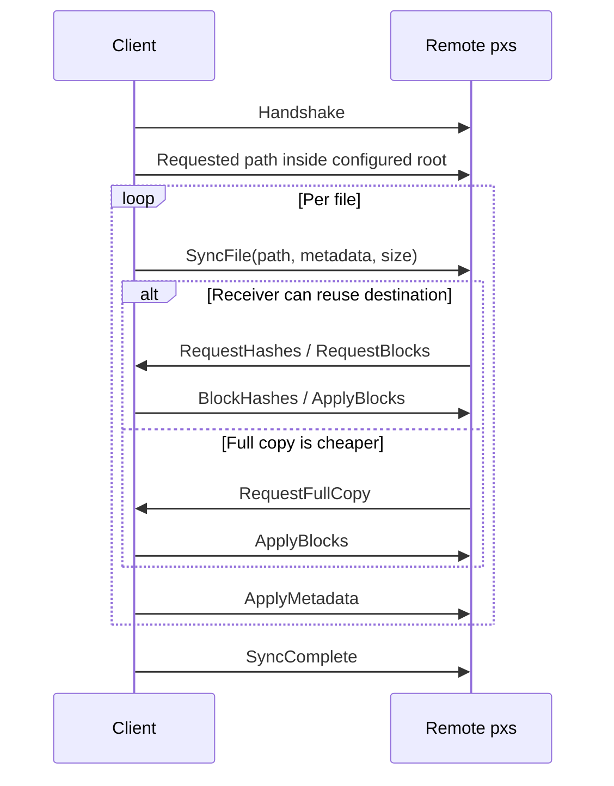
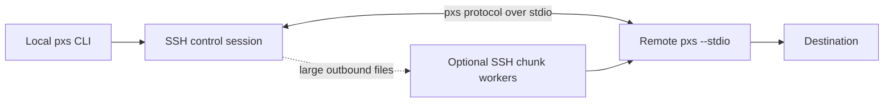

# pxs Design Notes

This document is for contributors and maintainers. The public product story
lives in [`README.md`](../README.md); this file keeps the protocol and design
notes out of the operator-facing front page.

## Objective

`pxs` is an integrity-first sync and clone tool for large mutable datasets. It
is built to keep destination trees exact while using parallelism, fixed-block
delta sync, and transport choices that can outperform `rsync` in target
workloads.

Target workloads include:

- PostgreSQL `PGDATA`
- VM images
- repeated refreshes of large trees with many unchanged files
- large files that are usually updated in place

Non-goals remain important:

- `pxs` is not a full `rsync -aHAXx` replacement
- the project does not currently promise hardlink, ACL, xattr, SELinux-label,
  or sparse-layout parity

## Public Command Model

The public sync interface is:

```bash
pxs sync DEST SRC
```

Where `DEST` and `SRC` can be:

- local filesystem paths
- SSH endpoints like `user@host:/path`
- raw TCP endpoints like `host:port/path`

Raw TCP setup commands remain:

- `pxs listen ADDR ROOT`
- `pxs serve ADDR ROOT`

`push` and `pull` remain hidden compatibility aliases, not the public story.

## Design Overview

### Local Sync


### Raw TCP Sync



### SSH Sync



SSH uses the same internal protocol shape as other network flows, but transports
it over stdio and can fan out large outbound transfers with additional worker
sessions.

## Sync Semantics

### Reuse vs Full Copy

`pxs` uses fixed 128 KiB blocks. For regular files:

1. If the destination does not exist or is not reusable, perform a full copy.
2. If size and mtime match and checksum mode is off, skip.
3. If the destination exists, compare `dst_size / src_size` against
   `--threshold`.
4. If the ratio is below the threshold, rewrite fully.
5. Otherwise, compute block hashes and transfer only changed blocks.

Default threshold:

- `0.1`

That default is intentionally low so partially existing files can still benefit
from block reuse instead of being rewritten too aggressively.

### Exactness and Safety

Current correctness model:

- exact file contents
- exact file/dir/symlink shape
- exact valid Unix names, including non-UTF8 names, over local and remote sync
- mode and mtime preservation
- ownership preservation when privileges allow
- staged replacement to preserve an existing destination until commit

Current safety model:

- reject symlinked destination roots and symlinked ancestor path components
- treat leaf symlinks as entries, not paths to follow
- resolve raw TCP requested paths beneath configured roots
- reject protocol traversal forms such as absolute paths, `.` and `..`

### Durability and Verification

- `--checksum` adds block comparison and end-to-end BLAKE3 verification for
  network transfers
- `--delete` converges destination directories by removing entries missing from
  the source
- `--fsync` makes committed writes, deletes, directory installs, symlink
  installs, and final metadata durable before completion is reported

## Why `pxs` Can Beat `rsync`

The answer is workload-specific, not universal:

- block hashing and comparison are parallel
- directory walking is concurrent
- fixed blocks favor many in-place update workloads
- raw TCP can avoid SSH overhead on trusted networks
- outbound SSH can fan out large files with worker sessions

The benchmark scripts in the repository should be understood as targeted
comparison helpers, not broad proof that `pxs` is always faster.

## Contributor Guidance

When public wording changes, update these surfaces together:

- `README.md`
- `Cargo.toml` package description
- CLI `ABOUT` and `LONG_ABOUT`
- benchmark script headers and usage text when they make public claims

Keep the README operator-focused. Put protocol detail and architecture notes
here instead of growing the front page.
